# Allocator Benchmarking Results

This doc contains the benchmarking results for different memory allocators. I compare the time taken for memory allocation and deallocation across various types of operations, including different block sizes and random allocation/deallocation.

## Table of Contents

1. [Benchmark Results for One Byte Allocation](#one-byte-allocation)
2. [Benchmark Results for Five Byte Allocation](#five-byte-allocation)
3. [Benchmark Results for One GB Allocation](#one-gb-allocation)
4. [Benchmark Results for Random Size Allocation](#random-size-allocation)
5. [Benchmark Results for Constructor/Destructor](#ctor-dtor)
6. [Benchmark Results for 256 Byte Block Allocation](#256-bytes-block-allocation)
7. [Benchmark Results for Random Allocation/Deallocation](#random-alloc-dealloc)
8. [Benchmark Results for Linear Allocation/Deallocation](#linear-alloc-dealloc)
9. [Benchmark results for all tests](#all-tests)

---

## One Byte Allocation

| Allocator | Time for One Allocation (microseconds) |
|-----------|-----------------------------------------|
| `calloc`  | 18.31                                   |
| `linear`  | 3.66                                    |
| `list`    | 4.72                                    |
| `pool`    | 21.15                                   |
| `stack`   | 3.25                                    |

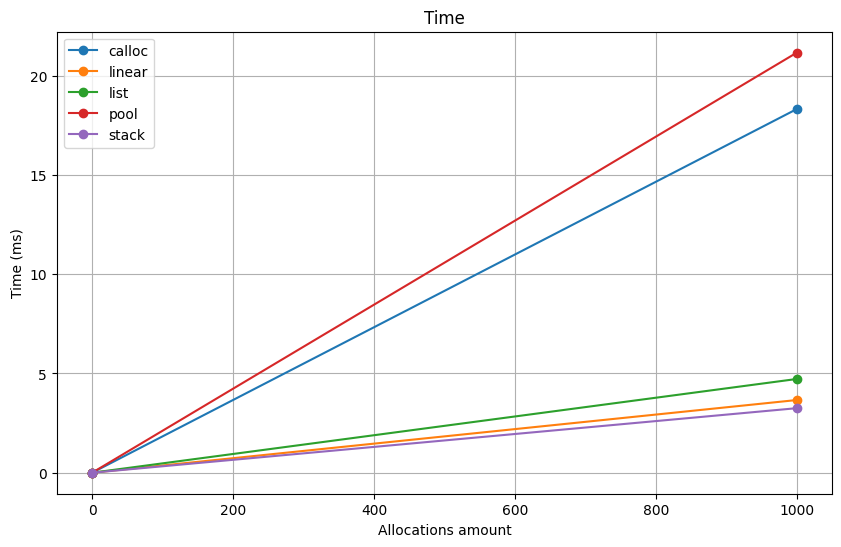

<div style="display: flex; align-items: center; justify-content: flex-start;">
  <div style="width: 60%; padding-right: 20px;">
    <ul>

- **Best Performance**: The `linear` allocator outperforms others in allocating one byte of memory, taking  **3.25 microseconds** per allocation.

- **Slowest Allocator**: The `pool` allocator, taking **21.15 microseconds**, is slower compared to custom allocators such as `linear`, `list`, and `stack`, as weel as `calloc`.

    </ul>
  </div>
  <div style="width: 35%; text-align: center;">
    
  </div>
</div>

---

## Five Byte Allocation

| Allocator | Time for One Allocation (microseconds) |
|-----------|-----------------------------------------|
| `calloc`  | 18.53                                   |
| `linear`  | 6.01                                    |
| `list`    | 4.83                                    |
| `pool`    | 21.15                                   |
| `stack`   | 4.25                                    |


<div style="display: flex; align-items: center; justify-content: flex-start;">
  <div style="width: 60%; padding-right: 20px;">
    <ul>

- **Performance**: The performance pattern remains similar to the one-byte allocation. `Stack` is the fastest, taking **4.25** microseconds. The `pool` allocator is still the slowest, taking **21.15** microseconds.

- **Decreased Overhead**: The performance difference between the allocators is less significant in five-byte allocations compared to one-byte allocations.

    </ul>
  </div>
  <div style="width: 35%; text-align: center;">
    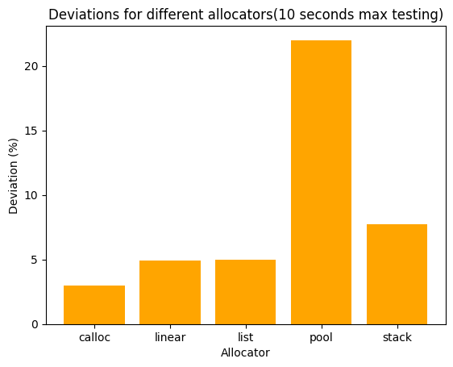
  </div>
</div>

---

## One GB Allocation

| Allocator | Time for One Operation (microseconds) |
|-----------|----------------------------------------|
| `calloc`  | 1002.86                                |
| `linear`  | 7.90                                   |
| `list`    | 31.35                                  |
| `pool`    | 73.79                                  |
| `stack`   | 28.46                                  |

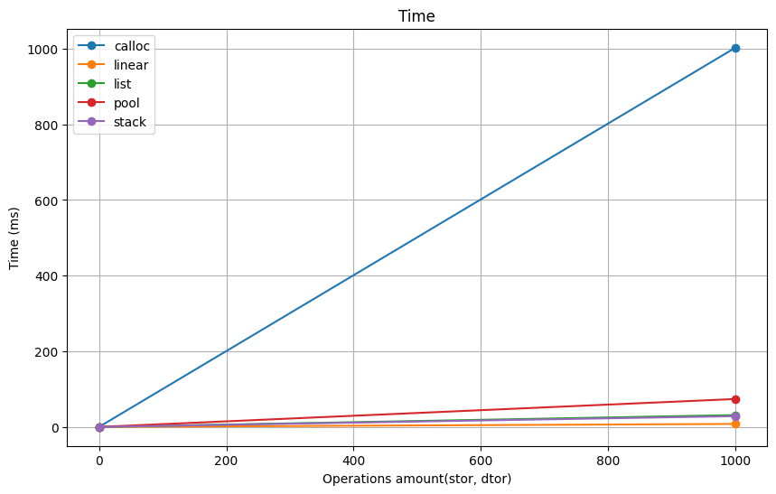

<div style="display: flex; align-items: center; justify-content: flex-start;">
  <div style="width: 60%; padding-right: 20px;">
    <ul>

- **Performance**: The `linear` allocator performs well in terms of time efficiency, taking **7.90** microseconds for allocating 1 GB. However, allocators like `calloc` take significantly longer, **1002.86** microseconds. `Pool` allocator showes significantly worse performance, taking **73.79**, 2.5 times more than other custom allocators, comparing to the small-szie allocations.

- **Efficiency**: For larger allocations like 1 GB, the efficiency gap between allocators widens.

    </ul>
  </div>
  <div style="width: 35%; text-align: center;">
    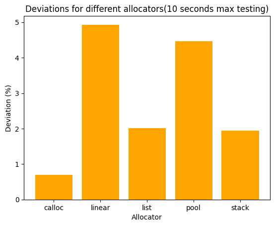
  </div>
</div>

---

## Random Size Allocation

| Allocator | Time for One Allocation (microseconds) |
|-----------|-----------------------------------------|
| `calloc`  | 65.12                                   |
| `linear`  | 9.23                                    |
| `list`    | 209.75                                  |
| `pool`    | 66.53                                   |
| `stack`   | 19.43                                   |

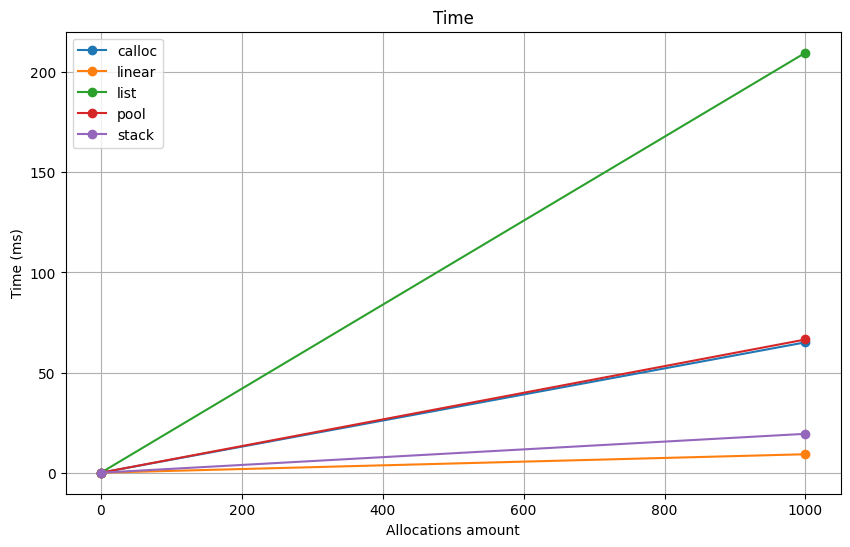

<div style="display: flex; align-items: center; justify-content: flex-start;">
  <div style="width: 60%; padding-right: 20px;">
    <ul>

- **Performance**: Random-sized allocations are generally slower across all allocators, but the `linear` allocator still holds up well at **9.23** microseconds. `List` is noticeably slower, taking **209.75** microseconds for a random allocation, which is **3.22** times more than calloc allocator. `Pool` allocator performs like a `calloc` allocator, because is has to re-create for each allocations.

- **Efficiency**: The `linear` allocator stands out as the most consistent and efficient allocator for random-size allocation scenarios.

    </ul>
  </div>
  <div style="width: 35%; text-align: center;">
    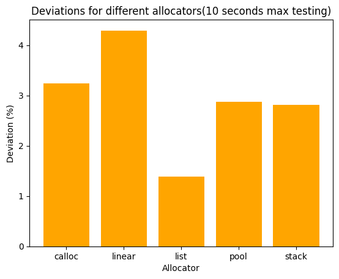
  </div>
</div>

---

## Constructor/Destructor (CTOR/DTOR)

| Allocator | Time for One Operation (microseconds) |
|-----------|----------------------------------------|
| `linear`  | 1606.35                                |
| `list`    | 13739.18                               |
| `pool`    | 14298.01                               |
| `stack`   | 14588.38                               |

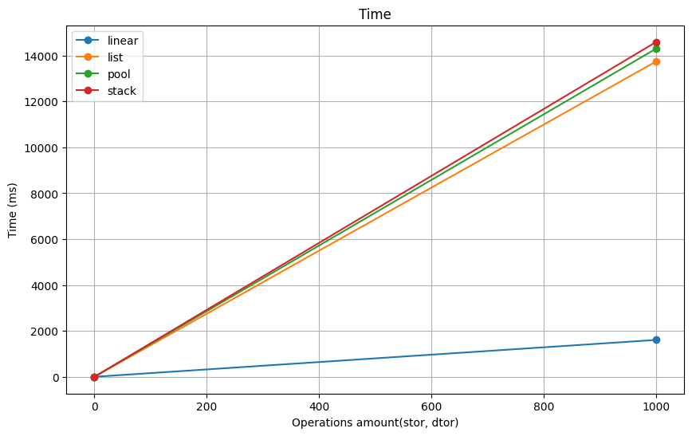

<div style="display: flex; align-items: center; justify-content: flex-start;">
  <div style="width: 60%; padding-right: 20px;">
    <ul>

- **Performance**: Allocators with constructors and destructors (list, pool, stack) take significantly more time due to the additional operations. `Linear` takes **1606.35** microseconds, which is considerably faster than the others.

    </ul>
  </div>
  <div style="width: 35%; text-align: center;">
    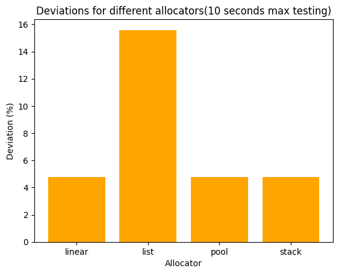
  </div>
</div>

---

## 256 Bytes Block Allocation

| Allocator | Time for One Allocation (microseconds) |
|-----------|-----------------------------------------|
| `calloc`  | 34.83                                   |
| `linear`  | 9.85                                    |
| `list`    | 7.95                                    |
| `pool`    | 8.94                                    |
| `stack`   | 7.04                                    |

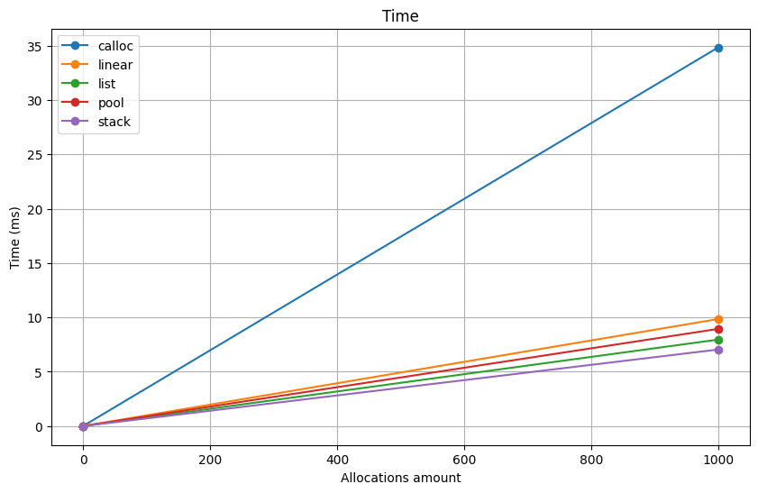

<div style="display: flex; align-items: center; justify-content: flex-start;">
  <div style="width: 60%; padding-right: 20px;">
    <ul>

- **Performance**: For block allocations of 256 bytes, the `stack` allocator performs the best, taking **7.04** microseconds per allocation. `Calloc` remains the slowest at 34.83 microseconds.

- **Efficiency**: Medium-sized block allocations (like 256 bytes) show that `custom` allocators (linear, pool, stack) outperform `calloc` significantly.

    </ul>
  </div>
  <div style="width: 35%; text-align: center;">
    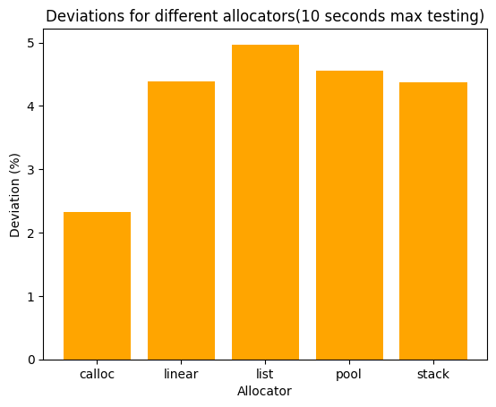
  </div>
</div>


---

## Random Allocation/Deallocation

| Allocator | Time for One Operation (microseconds) |
|-----------|---------------------------------------|
| `list`    | 302.68                                |
| `pool`    | 73.74                                 |
| `stack`   | 24.71                                 |

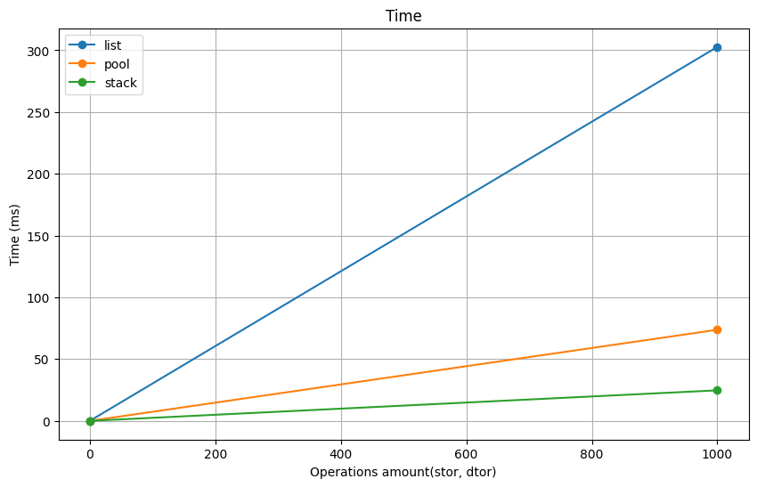

<div style="display: flex; align-items: center; justify-content: flex-start;">
  <div style="width: 60%; padding-right: 20px;">
    <ul>
      <li><strong>Performance</strong>: Random allocation and deallocation operations are the most time-consuming for all allocators. The <code>list</code> allocator takes the longest (302.68 microseconds), while <code>stack</code> is the fastest at 24.71 microseconds.</li>
      <li><strong>Efficiency</strong>: For random allocation and deallocation, <code>stack</code> and <code>pool</code> allocators exhibit much better performance than <code>list</code>.</li>
    </ul>
  </div>
  <div style="width: 35%; text-align: center;">
    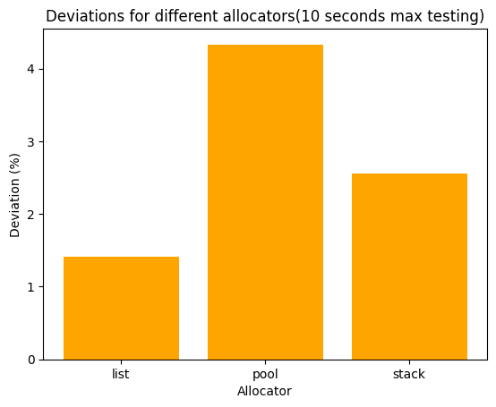
  </div>
</div>

---
## Linear Allocation/Deallocation

<div style="display: flex; align-items: center;">
  <div style="width: 40%;">
    <table>
      <thead>
        <tr>
          <th>Size of a memory block</th>
          <th>Time for one alloc (microseconds)</th>
        </tr>
      </thead>
      <tbody>
        <tr><td>1</td><td>12.393035</td></tr>
        <tr><td>5</td><td>6.980100</td></tr>
        <tr><td>10</td><td>7.039801</td></tr>
        <tr><td>50</td><td>6.970149</td></tr>
        <tr><td>100</td><td>7.088803</td></tr>
        <tr><td>200</td><td>6.975124</td></tr>
        <tr><td>500</td><td>7.024876</td></tr>
        <tr><td>1000</td><td>5.219421</td></tr>
        <tr><td>2000</td><td>11.036842</td></tr>
        <tr><td>5000</td><td>10.800866</td></tr>
        <tr><td>10000</td><td>5.170129</td></tr>
        <tr><td>50000</td><td>10.723077</td></tr>
        <tr><td>100000</td><td>5.164777</td></tr>
        <tr><td>200000</td><td>10.933121</td></tr>
      </tbody>
    </table>
  </div>
  <div style="width: 60%; padding-left: 10px;">
    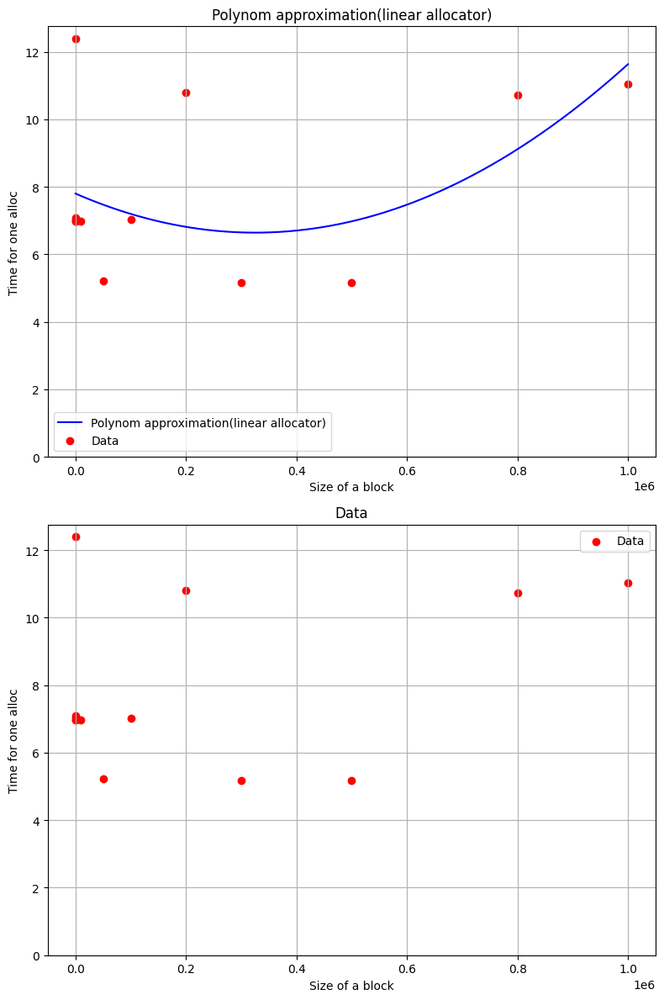
  </div>
</div>


- **Initial Small Allocations (1-10 bytes)**:
  The `linear` allocator shows an initial performance penalty when allocating small memory blocks (e.g., 1 byte and 5 bytes). At the 1-byte block size, the allocator takes approximately 12.39 microseconds, and at 5 bytes, it takes around 6.98 microseconds. This suggests that for very small allocations, the linear allocator may incur overhead that is not present in other allocators (such as `pool` or `stack`).

- **Stability Across Medium-Sized Allocations (50-1000 bytes)**:
  For block sizes between 50 bytes and 1000 bytes, the time per allocation remains fairly stable, hovering between 6.97 and 7.08 microseconds. This suggests that the linear allocator handles medium-sized blocks with consistent efficiency. The minimal variation in allocation times indicates that the allocator's overhead remains relatively constant for these block sizes.

- **Performance Drop for Larger Allocations (2000-200000 bytes)**:
  The allocator's performance drops significantly for larger memory blocks. For example, at 2000 bytes, the time for one allocation spikes to 11.04 microseconds. Allocation times continue to fluctuate, with peaks at 50,000 bytes (10.72 microseconds) and 200,000 bytes (10.93 microseconds).

---

## All tests

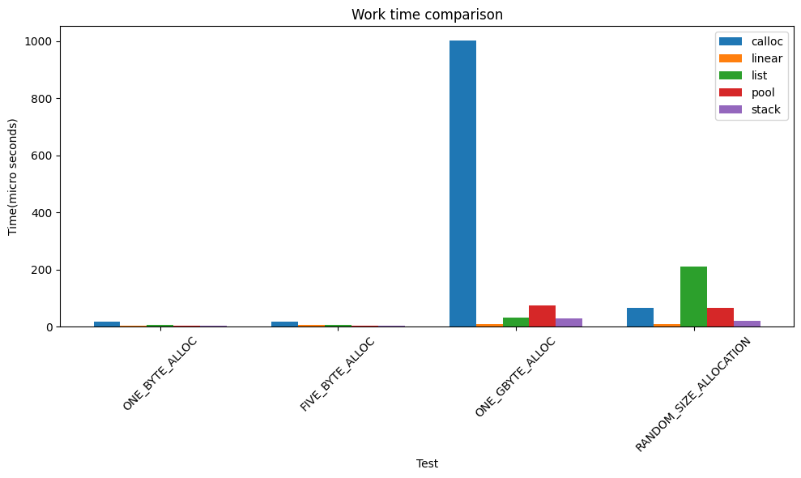

Without calloc:

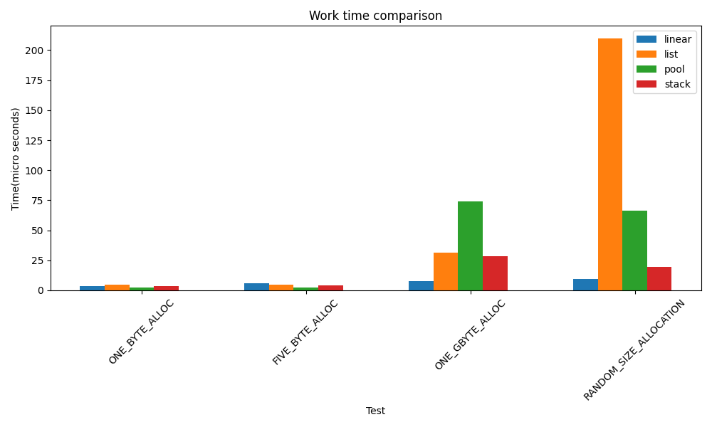

- **General Observations**:

- Linear Allocator: The `linear` allocator demonstrates the best overall performance in many of the benchmarks, particularly for large allocations. It is the fastest allocator in tests like one-byte allocation (3.66 microseconds), random size allocation (9.23 microseconds), and one GB allocation (7.90 microseconds).

- Stack Allocator: `Stack` Allocator consistently shows good performance across various tests, particularly excelling in scenarios with small to medium-sized allocations. It performs best in the 256-byte block allocation and random allocation/deallocation, taking 7.04 microseconds and 24.71 microseconds, respectively. It is also competitive in one-byte and five-byte allocations, where it outperforms list and pool allocators.

- Pool Allocator: The `pool` allocator shows poor performance in most benchmarks, particularly in random-sized allocation and 1 GB allocation. It is significantly slower than the other custom allocators, with times of 66.53 microseconds and 73.79 microseconds, respectively. It is also slower than calloc in most cases

- List Allocator: The `list` allocator is one of the slowest custom allocators overall. It performs poorly in almost all scenarios, particularly random-sized allocations, where it takes 209.75 microseconds, significantly slower than calloc (66.53 microseconds) and other custom allocators.

---

## Memory Block Structure and Metadata Analysis

[Header] | [Data] | [Padding]

- **Header**: Contains metadata such as the block's size, pointers to other blocks.
- **Data**: This is the region where user data is stored after allocation.
- **Padding**: Sometimes, memory is padded to ensure proper alignment or prevent fragmentation.

### Linear Allocator

- No metadata

### Pool Allocator

- No additional memory for metadata, however size of a block cannot be smaller that the sizeof(void*)

### Stack Allocator

- Metadata takes sizeof(uintptr_t) bytes for each memory block

### List Allocator

- Metadata takes sizeof(header_t) additional bytes for each block.

``` c

typedef struct {
    size_t size;
    void* next;
    void* prev;
} header_t;

```

---

| **Allocator**     | **Metadata** | **Memory Overhead per Block (64-bit)** |
|-------------------|--------------|----------------------------------------|
| **Linear**        | None         | 0 bytes                                |
| **Pool**          | No explicit metadata, but the block size must be at least `sizeof(void*)` | **8 bytes** (or 4 bytes on 32-bit systems) |
| **Stack**         | `uintptr_t` (for each block) | **8 bytes** (or 4 bytes on 32-bit systems) |
| **List**          | `header_t` structure with three fields (`size`, `next`, `prev`) | **24 bytes** (or 12 bytes on 32-bit systems) |

## Quantitive comparison of memory usage for metadata

|             | **char(1 byte)** | **int(4 bytes)** | **double(8 bytes)** | **char[100]** | **char[1000]** |
|-------------|------------------|------------------|---------------------|---------------|----------------|
| **Linear**  | 0                | 0                | 0                   | 0             |  0             |
| **Pool**    | 87.5%            | 50.0%            | 0                   | 0             |  0             |
| **Stack**   | 88.9%            | 66.7%            | 50.0%               | 7.4%          | 8 * 10^(-3)%   |
| **List**    | 96.0%            | 85.7%            | 75.0%               | 19.4%         | 2 * 10^(-1)%   |

---

### Memory Alignment

Proper alignment is important for:
- **Performance**: Misaligned data can result in slower memory accesses due to additional instructions needed for reading or writing.
- **Correctness**: On some systems, misaligned data access may cause runtime errors or crashes.
- **Portability**: Different hardware architectures have different alignment requirements.

#### Alignment Example in Code

In the following code snippet, alignment is conditionally defined based on the compiler and the target architecture. This ensures that memory is properly aligned according to the system's requirements.

```c
//#ifdef __ALIGNMENT__
    #if defined(_MSC_VER)
        #define ALIGNMENT 8
    #elif defined(__GNUC__)
        #if defined(__x86_64__) || defined(__aarch64__) || defined(_WIN64)
            #define ALIGNMENT 8
        #elif defined(__i386__) || defined(__arm__) || defined(_WIN32)
            #define ALIGNMENT 4
        #else
            #define ALIGNMENT 2 // NOTE: or 1
        #endif /* 64-bits / 32-bits / other */
    #elif defined(__arm__)
        #define ALIGNMENT 8
    #elif defined(__powerpc__)
        #define ALIGNMENT 8
    #else
        #define ALIGNMENT 4
    #endif /* compiler type */
//#endif /* __ALIGNMENT__ */
```

